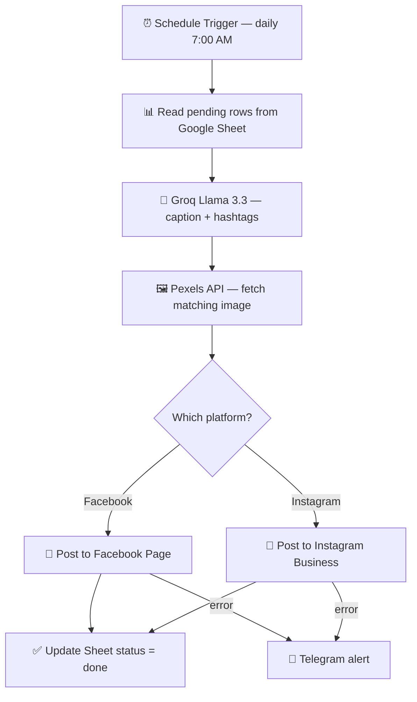

# 🤖 Social Media Auto Poster

**An n8n workflow that writes, illustrates and publishes social media content to Facebook & Instagram — completely hands-free.**

[](https://n8n.io)
[](https://groq.com)
[](https://developers.facebook.com)
[](#-license)

---

## 📌 Overview

Most small businesses lose hours every week writing captions, hunting for images, and posting them one platform at a time. This workflow removes that work completely.

You add a topic to a Google Sheet — everything after that is automatic. The AI writes the caption and hashtags, a matching image is pulled from Pexels, the post goes live on Facebook and Instagram, and the sheet is updated. If something fails, you get a Telegram alert instead of a silent failure.

**Outcome:** a full week of social content published from one 5-minute sheet update.

---

## ✨ Features

- 🧠 **AI caption generation** — Groq (Llama 3.3) writes the caption and hashtags
- 🖼️ **Automatic images** — relevant photo pulled from the Pexels API
- 📘 **Facebook Page publishing** via the Meta Graph API
- 📸 **Instagram Business publishing** (two-step container + publish)
- 📊 **Google Sheets as the content calendar** — non-technical clients can run it
- 📱 **Telegram error alerts** — you know instantly if a post fails
- ⏰ **Scheduled daily posting** at 7:00 AM (configurable)
- ♻️ **Status write-back** — every row is marked `done` or `failed`

---

## 🔄 How It Works



---

## 🛠️ Tech Stack

| Tool | Purpose |
|------|---------|
| **n8n** | Workflow orchestration |
| **Groq — Llama 3.3** | Caption and hashtag generation |
| **Pexels API** | Royalty-free image sourcing |
| **Meta Graph API** | Facebook & Instagram publishing |
| **Google Sheets** | Content calendar and status tracking |
| **Telegram Bot** | Error notifications |

---

## 📊 Google Sheet Structure

| Column | Description | Example |
|--------|-------------|---------|
| `ID` | Unique post ID | 001 |
| `Topic` | What the post is about | 5 AI tools for small business |
| `keywords` | Image search keywords | artificial intelligence, office |
| `Status` | `pending` / `done` / `failed` | pending |
| `Platform` | Facebook / Instagram | Facebook |
| `Post_Date` | Scheduled date | 2026-09-05 |
| `Post_Time` | Scheduled time | 07:00 |

---

## 🚀 Setup Guide

### 1. Prerequisites

- n8n (self-hosted or cloud)
- Meta Developer account with a Facebook Page + linked Instagram Business account
- Groq API key
- Pexels API key
- A Telegram bot and chat ID

### 2. Import the workflow

1. Open n8n
2. Click the **⋯** menu → **Import from File**
3. Select `workflow.json`
4. Add your own credentials (see below)

### 3. Connect your Google Sheet

Copy the column structure above into a new sheet and connect it to the Google Sheets node.

### 4. Test before scheduling

Run the workflow manually with one `pending` row before enabling the schedule trigger.

---

## 🔐 Required Credentials

Use `credentials-template.txt` as your reference. **Never commit real keys.**

```env
META_SYSTEM_USER_TOKEN=your_token_here
GROQ_API_KEY=your_key_here
PEXELS_API_KEY=your_key_here
TELEGRAM_BOT_TOKEN=your_token_here
TELEGRAM_CHAT_ID=your_chat_id_here
```

### Meta App Permissions

```
pages_manage_posts
pages_read_engagement
instagram_basic
instagram_content_publish
```

---

## 📁 Project Structure

```
social-media-automation/
├── workflow.json              # Importable n8n workflow
├── credentials-template.txt   # Placeholder credentials (no real keys)
├── .gitignore                 # Blocks secrets from ever being committed
└── README.md                  # This file
```

---

## 🛡️ Security Notes

- Never commit real API tokens — use `credentials-template.txt` as a reference only
- Store all secrets inside n8n's own credential manager
- Rotate the Meta System User Token periodically
- The included `.gitignore` blocks `.env` and credential files by default

---

## 🗺️ Roadmap

- [ ] LinkedIn and Threads publishing
- [ ] AI image generation as a Pexels fallback
- [ ] Best-time-to-post scheduling
- [ ] Engagement metrics written back to the sheet

---

## 👤 Author

**Subtain Nisar Abbasi** — AI Automation & CRM Workflow Specialist
Founder, **Ai Spark** — AI automation for small businesses

- 🌐 Portfolio — [aispark.info](https://aispark.info)
- 💼 Upwork — [Hire me](https://www.upwork.com/freelancers/~01bf71a6221daaf1b0)
- 🎯 Fiverr — [Hire me](https://www.fiverr.com/subtain143)
- 💬 LinkedIn — [subtain-nisar-abbasi](https://www.linkedin.com/in/subtain-nisar-abbasi-265643261/)

> Need a custom automation like this for your business? Get in touch — I build these end to end.

---

## 📄 License

Released under the **MIT License** — free to use, modify and build on.

---

⭐ If this workflow saved you time, a star helps others find it.
